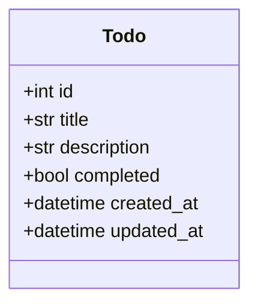

# Todo App Architecture - Phase I: Console Application

## System Architecture Overview

### Core Components
1. **Todo Model**: Defines the data structure for todo items
2. **Todo Service**: Handles business logic for todo operations
3. **Todo Repository**: Manages data persistence and retrieval
4. **Console Interface**: Provides user interaction through command line
5. **Configuration Manager**: Handles application settings

### Data Model


### Technology Stack
- **Language**: Python 3.13+
- **Dependency Management**: UV
- **ORM**: SQLModel (preparing for future database integration)
- **Testing**: pytest
- **Code Quality**: ruff, mypy

### Layered Architecture
```
┌─────────────────┐
│  Console UI     │ ← User interaction layer
├─────────────────┤
│  Application    │ ← Service orchestration
│  Services       │
├─────────────────┤
│  Business Logic │ ← Domain models and rules
├─────────────────┤
│  Data Access    │ ← Repository pattern
│  Layer          │
├─────────────────┤
│  Database       │ ← SQLModel + PostgreSQL
│  Layer          │
└─────────────────┘
```

### Security Considerations
- Input validation for all user inputs
- Safe data handling
- Proper error handling without exposing internal details

### Testing Strategy
- Unit tests for all business logic
- Integration tests for data access
- End-to-end tests for critical user flows